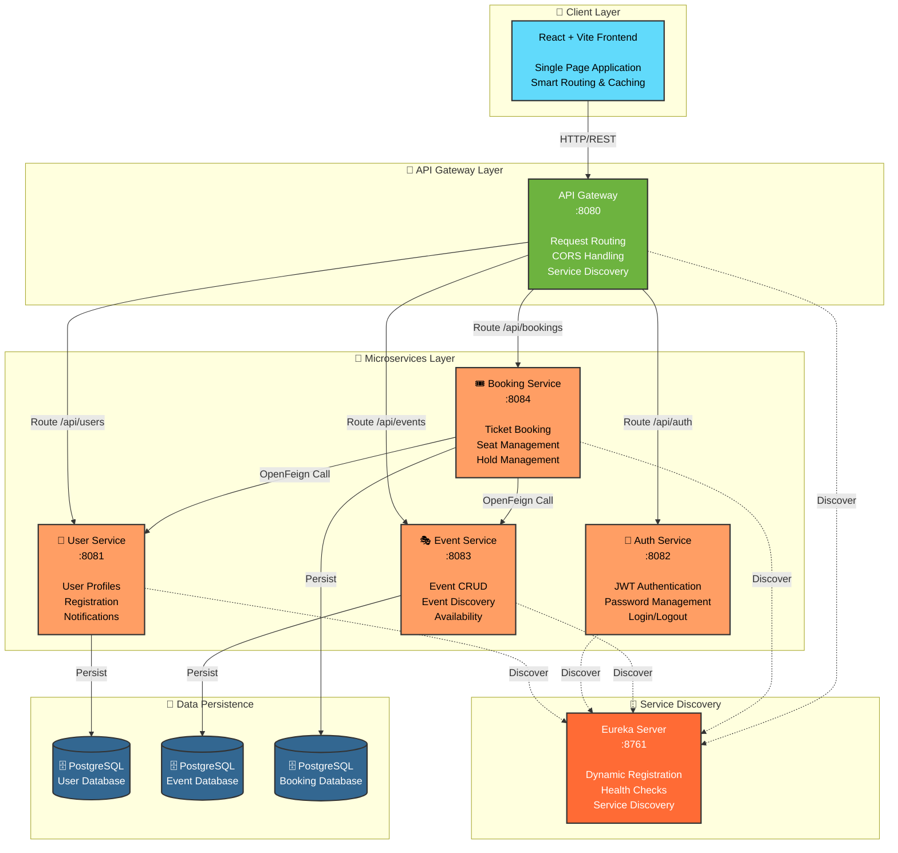

# 🎟️ StageFront

### Service-Oriented Architecture Event Ticketing Platform

[](https://www.oracle.com/java/)
[](https://spring.io/projects/spring-boot)
[](https://spring.io/projects/spring-cloud)
[](https://react.dev/)
[](https://www.postgresql.org/)
[](https://github.com/Netflix/eureka)
[](https://spring.io/projects/spring-cloud-openfeign)

---

## 🚀 Overview

**StageFront** is a comprehensive, production-ready microservices platform designed to handle high-volume event discovery, booking, and management. Built with a service-oriented architecture (SOA) using Spring Boot and Spring Cloud, StageFront provides a scalable solution for venues and platforms managing event ticketing at enterprise scale.

The platform addresses the critical challenges of event management: real-time seat availability tracking, concurrent ticket bookings, secure user authentication, and seamless inter-service communication. With its distributed architecture, StageFront ensures reliability, scalability, and maintainability across all operations—from user registration and authentication to event discovery and ticket booking.

**StageFront** decouples critical business domains into independent microservices that communicate through a centralized API Gateway, enabling teams to develop, deploy, and scale services independently while maintaining system cohesion through service discovery and inter-service collaboration via OpenFeign.

---

## ✨ Key Features

| Feature | Description | Service |
|---------|-------------|---------|
| 🔐 **Secure Authentication** | JWT-based token authentication with login, logout, and session management | Auth Service |
| 👤 **User Management** | Complete user profile management, registration, and account administration | User Service |
| 🛡️ **Role-Based Access Control** | Support for USER and ADMIN roles with granular permission handling | Auth + User Services |
| 🎭 **Event Management** | Full CRUD operations for events: create, read, update, and delete | Event Service |
| 🎟️ **Ticket Booking** | Real-time ticket booking with seat management and availability tracking | Booking Service |
| 💺 **Seat & Capacity Management** | Accurate seat availability, hold management, and capacity constraints | Booking Service |
| 🔑 **Advanced Password Security** | Forgot password, password reset, and change password workflows with 6-digit reset codes | Auth Service |
| 🔔 **User Notifications** | Booking confirmations and notification management | User Service |
| 🌐 **Unified API Gateway** | Single entry point for all client requests with centralized routing | API Gateway |
| 🔎 **Service Discovery** | Eureka-based dynamic service registration and discovery for zero-downtime deployments | Eureka Server |
| 🔗 **Inter-Service Communication** | OpenFeign-based declarative REST clients for service-to-service communication | Booking Service |
| 📊 **Admin Dashboard** | Comprehensive administrative functionality for event and user management | All Services |
| 📚 **API Documentation** | Built-in Swagger/OpenAPI documentation for all services | All Services |

---

## 🏗️ System Architecture



---

## 📋 Microservices Overview

### **🌐 API Gateway** (Port 8080)
Centralized request router for all client requests. Routes requests to appropriate microservices using Spring Cloud Gateway with reactive WebFlux.
- **Role**: Request routing, centralized entry point
- **Tech**: Spring Cloud Gateway, WebFlux
- **Dependencies**: Eureka Client

### **🔐 Auth Service** (Port 8082)
Handles all authentication and password management operations with JWT token generation.
- **Endpoints**: Login, Forgot Password, Reset Password, Change Password
- **Features**: JWT token generation, BCrypt password hashing, 6-digit reset codes
- **Tech**: Spring Boot, Spring Security Crypto
- **Database**: N/A (stateless)

### **👤 User Service** (Port 8081)
Manages user profiles, registration, and notification handling with role-based access control.
- **Endpoints**: User CRUD, Registration, User By Email, Notifications
- **Features**: User profiles, role management (USER/ADMIN), notification service
- **Tech**: Spring Boot, Spring Data JPA, PostgreSQL
- **Database**: PostgreSQL (stagefront_user_db)

### **🎭 Event Service** (Port 8083)
Provides event management functionality including creation, updates, and discovery.
- **Endpoints**: Event CRUD, Find All Events, Event Discovery
- **Features**: Event creation, modification, deletion, and detailed event information
- **Tech**: Spring Boot, Spring Data JPA, PostgreSQL
- **Database**: PostgreSQL (stagefront_event_db)

### **🎟️ Booking Service** (Port 8084)
Handles ticket booking operations with real-time seat management and booking holds.
- **Endpoints**: Booking CRUD, Booking Status, Seat Availability
- **Features**: Ticket booking, seat holds, booking cancellations, hold cleanup
- **Tech**: Spring Boot, Spring Data JPA, OpenFeign, PostgreSQL
- **Database**: PostgreSQL (stagefront_booking_db)
- **External Calls**: User Service, Event Service (via OpenFeign)

### **🔎 Eureka Server** (Port 8761)
Service discovery and registration server enabling dynamic service location and health checks.
- **Role**: Service registry, health monitoring
- **Tech**: Spring Cloud Netflix Eureka
- **Dashboard**: http://localhost:8761

---

## 🛠️ Technology Stack

| Component | Technology | Version | Purpose |
|-----------|-----------|---------|---------|
| **Backend Framework** | Spring Boot | 4.1.1 | Microservices foundation |
| **Cloud Platform** | Spring Cloud | 2025.1.2 | Distributed systems support |
| **Language** | Java | 17 | JVM-based development |
| **API Gateway** | Spring Cloud Gateway | 2025.1.2 | Request routing and service routing |
| **Service Discovery** | Eureka | Netflix OSS | Dynamic service registration |
| **Inter-Service Communication** | OpenFeign | Spring Cloud | Declarative REST clients |
| **Data Access** | Spring Data JPA | Included | ORM and database access |
| **Database** | PostgreSQL | Latest | Persistent data storage |
| **Security** | Spring Security Crypto | Included | Password hashing and encryption |
| **Frontend** | React | Latest | User interface framework |
| **Build Tool** | Vite | Latest | Fast frontend development |
| **API Documentation** | Springdoc OpenAPI | 2.8.13 | Swagger UI and OpenAPI specs |
| **Build Management** | Maven | 3.9+ | Java build tool |

---

## 🚀 Quick Start

### Prerequisites
- **Java 17** or higher
- **Maven 3.9+**
- **PostgreSQL 12+**
- **Node.js 18+** and **npm 9+**

### Database Setup

Create three PostgreSQL databases:
```sql
CREATE DATABASE stagefront_user_db;
CREATE DATABASE stagefront_event_db;
CREATE DATABASE stagefront_booking_db;
```

### Environment Configuration

Create a `.env` file in the project root by copying `.env.example`:
```bash
cp .env.example .env
```

Update the `.env` file with your database credentials:
```properties
DATABASE_URL=jdbc:postgresql://localhost:5432/stagefront_user_db
DATABASE_USERNAME=postgres
DATABASE_PASSWORD=your_secure_password
```

### Running the Microservices

Start services in the specified order (allow ~10 seconds between each):

**Terminal 1: Eureka Server**
```bash
cd Backend/eureka-server
mvn spring-boot:run
```
Visit: http://localhost:8761

**Terminal 2: User Service**
```bash
cd Backend/user-service
mvn spring-boot:run
```

**Terminal 3: Auth Service**
```bash
cd Backend/auth-service
mvn spring-boot:run
```

**Terminal 4: Event Service**
```bash
cd Backend/event-service
mvn spring-boot:run
```

**Terminal 5: Booking Service**
```bash
cd Backend/booking-service
mvn spring-boot:run
```

**Terminal 6: API Gateway**
```bash
cd Backend/api-gateway
mvn spring-boot:run
```

**Terminal 7: Frontend (React)**
```bash
cd Frontend
npm install
npm run dev
```

Access the frontend at: http://localhost:5173

---

## 📚 API Documentation

Each microservice includes Swagger/OpenAPI documentation:

| Service | Swagger UI | Endpoint |
|---------|-----------|----------|
| User Service | http://localhost:8081/swagger-ui.html | `/api/users` |
| Auth Service | http://localhost:8082/swagger-ui.html | `/api/auth` |
| Event Service | http://localhost:8083/swagger-ui.html | `/api/events` |
| Booking Service | http://localhost:8084/swagger-ui.html | `/api/bookings` |
| API Gateway | http://localhost:8080 | Unified routing |

### Core API Endpoints

**Authentication**
- `POST /api/auth/login` - User login with email and password
- `POST /api/auth/forgot-password` - Request password reset
- `POST /api/auth/reset-password` - Reset password with reset code
- `POST /api/auth/change-password` - Change password for authenticated user

**Users**
- `GET /api/users` - List all users (admin)
- `POST /api/users` - Register new user
- `GET /api/users/{id}` - Get user profile
- `PUT /api/users/{id}` - Update user profile
- `GET /api/users/email/{email}` - Find user by email

**Events**
- `GET /api/events` - List all events
- `POST /api/events` - Create new event (admin)
- `GET /api/events/{id}` - Get event details
- `PUT /api/events/{id}` - Update event (admin)
- `DELETE /api/events/{id}` - Delete event (admin)

**Bookings**
- `GET /api/bookings` - List user bookings
- `POST /api/bookings` - Create booking
- `GET /api/bookings/{id}` - Get booking details
- `PUT /api/bookings/{id}` - Update booking
- `DELETE /api/bookings/{id}` - Cancel booking

---

## 📊 System Capabilities

### High-Volume Booking Management
- Real-time seat availability tracking
- Concurrent booking support with hold management
- Automatic hold cleanup with configurable timeouts
- Booking status transitions (PENDING, CONFIRMED, CANCELLED)

### Scalability & Reliability
- Horizontally scalable microservices
- Service discovery with automatic failover
- Stateless services for easy replication
- Database per service pattern

### Security
- JWT-based authentication and authorization
- BCrypt password hashing
- Role-based access control (RBAC)
- Secure password recovery flows
- Input validation and sanitization

### Developer Experience
- OpenAPI/Swagger documentation
- Unified API Gateway routing
- Service-to-service communication via OpenFeign
- Comprehensive logging and error handling

---

## 📁 Project Structure

```
StageFront/
├── Backend/
│   ├── api-gateway/              # Spring Cloud Gateway
│   ├── auth-service/             # Authentication & JWT
│   ├── user-service/             # User Management
│   ├── event-service/            # Event Management
│   ├── booking-service/          # Ticket Booking
│   └── eureka-server/            # Service Discovery
├── Frontend/                      # React + Vite
├── AI-Frontend/                   # Alternative Frontend
├── Docs/                          # Documentation
├── Postman/                       # API Collection
├── .env.example                   # Environment template
├── .gitignore                     # Git ignore rules
└── README.md                      # This file
```

---

## 🔐 Security Features

✅ **JWT Authentication** - Stateless token-based authentication  
✅ **Password Encryption** - BCrypt hashing with salt  
✅ **Role-Based Access** - USER and ADMIN role separation  
✅ **Secure Password Recovery** - 6-digit reset codes with expiration  
✅ **Input Validation** - Jakarta validation annotations  
✅ **CORS Configuration** - Controlled cross-origin access  
✅ **Password Change** - Secure password modification workflow  

---

## 🧪 Testing & Development

### Running Tests

```bash
# User Service
cd Backend/user-service
mvn test

# Event Service
cd Backend/event-service
mvn test

# Booking Service
cd Backend/booking-service
mvn test
```

### Using Postman

Import the provided Postman collection for API testing:
1. Postman Collection: `Postman/StageFront_Postman_Collection.json`
2. Environment: `Postman/StageFront_Local.postman_environment.json`

See `Postman/README.md` for detailed testing instructions.

---

## 📈 Performance Considerations

- **Database Indexing**: All entity IDs and foreign keys are indexed
- **Connection Pooling**: HikariCP configured for optimal connection management
- **Service Caching**: Strategic caching at gateway level
- **Async Operations**: Booking holds cleanup runs asynchronously
- **Request Routing**: API Gateway efficiently routes requests to appropriate services

---

## 🤝 Contributing

Contributions are welcome! To contribute:

1. Create a feature branch from `main`
2. Make your changes with descriptive commits
3. Ensure tests pass: `mvn clean test`
4. Submit a pull request with detailed description

---


## 📞 Support & Documentation

- **Architecture**: See `Docs/architecture.md`
- **API Details**: See `Docs/api-documentation.md`
- **Database Design**: See `Docs/database-design.md`
- **Deployment**: See `Docs/deployment.md`
- **Testing**: See `Docs/testing.md`

---

## 🎯 Roadmap

- [ ] WebSocket support for real-time updates
- [ ] Advanced analytics and reporting
- [ ] Payment gateway integration
- [ ] Email notification service
- [ ] SMS notifications
- [ ] Mobile app (iOS/Android)
- [ ] API rate limiting and quotas
- [ ] Advanced seat selection UI
- [ ] Event recommendations
- [ ] Waitlist management

---

## 🙏 Acknowledgments

StageFront is built with:
- Spring Framework & Spring Boot ecosystem
- Netflix Eureka for service discovery
- OpenFeign for declarative REST clients
- React and Vite for modern frontend development
- PostgreSQL for reliable data persistence

---

**Built with ❤️ using Spring Boot and React**

Last Updated: September 2, 2026 | Version: 0.0.1-SNAPSHOT
